<h1 align="center">SMART HOME PROJECT</h1>

I recently decided to turn my "dumb" home into a smart one. I am doing it step by step and by testing lots of different brands or products to find the ones that best fit my needs.
I ran into multiple issues during the process so I decided to create this documentation to remind myself how I got over them, as well as help others who might encounter the same issues.

# CHOOSING AN ECOSYSTEM

## Which one did I choose ?

There are 3 main ecosystems when it comes to smart home: Apple's HomeKit, Google Home and Amazon's Alexa. They each have their pros and cons, and people with different tastes or means will have different preferences. I chose Apple's solution for many reasons:
  - Everyone in my house has at least an iPhone, we also have MacBooks, iPads and I have an Apple Watch, so we are all comfortable with Apple's ecosystem.
  - I find the Home app minimalist UI very pleasing and easy to use.
  - I am into iOS programming so if I ever start a smart home project, it is likely to be embedded in Apple's ecosystem.
  - We have a Google Nest and most HomeKit compatible products also work with Google Home, whereas the opposite isn't necessarily true.
  - I tend to trust Apple over Google or Amazon when it comes to privacy.

## HOOBS - How did I solve compatibility issues ?

One of HomeKit's biggest con is that the range of compatible products is not as wide as other ecosystems', and they are often very expensive (my YeeLight bulb cost the price of my 4 LSC Smart Connect bulbs).
Luckily, there are ways to fix compatibility issues, allowing us to turn (almost) any smart device into an HomeKit compatible device: I chose HOOBS, which stands for Homebridge Out Of the Box System.

# MY SMART DEVICES

## Light Bulbs
| Look | Packaging | Description |
|-|-|-|
| 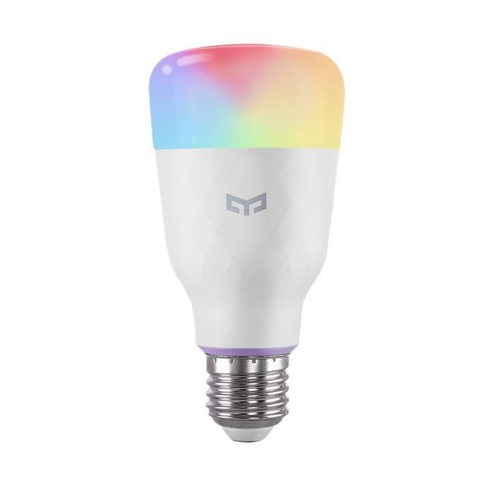 | 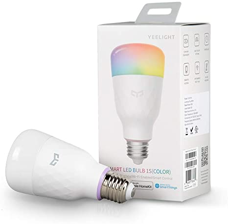 | 
[Yeelight Smart LED Bulb 1S](https://www.amazon.fr/Yeelight-millions-couleurs-Compatible-Assistant/dp/B0832XR68B/ref=sxts_sxwds-bia-wc-p13n1_0) I only own one bulb, which costs under 30€. It is HomeKit compatible and does not require a hub. It has a very wide range of colors and intensities. It is a bit big (20+ centimeters) but has a fine design. This is definitely my favorite bulb so far.
|
| 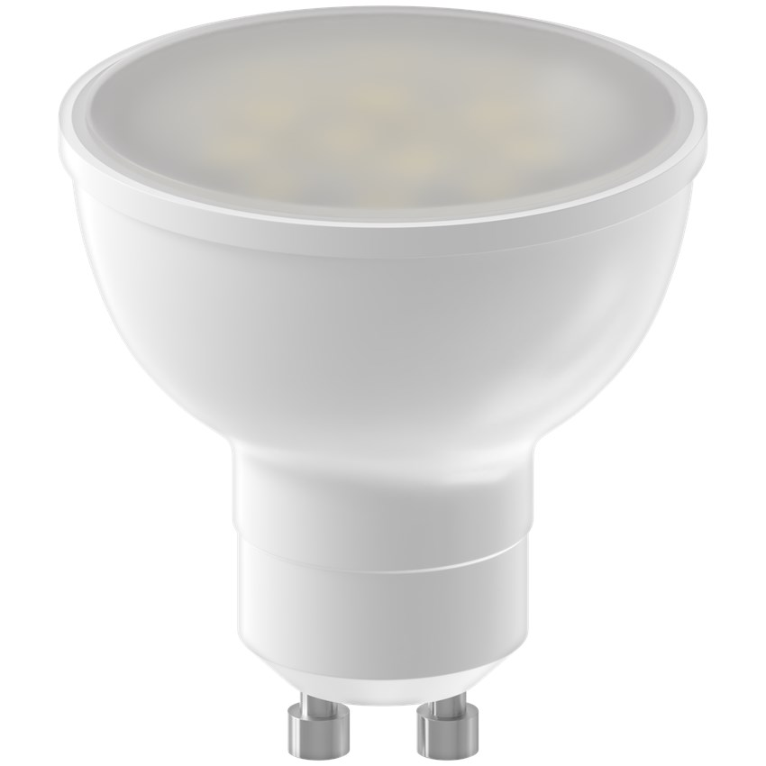 | 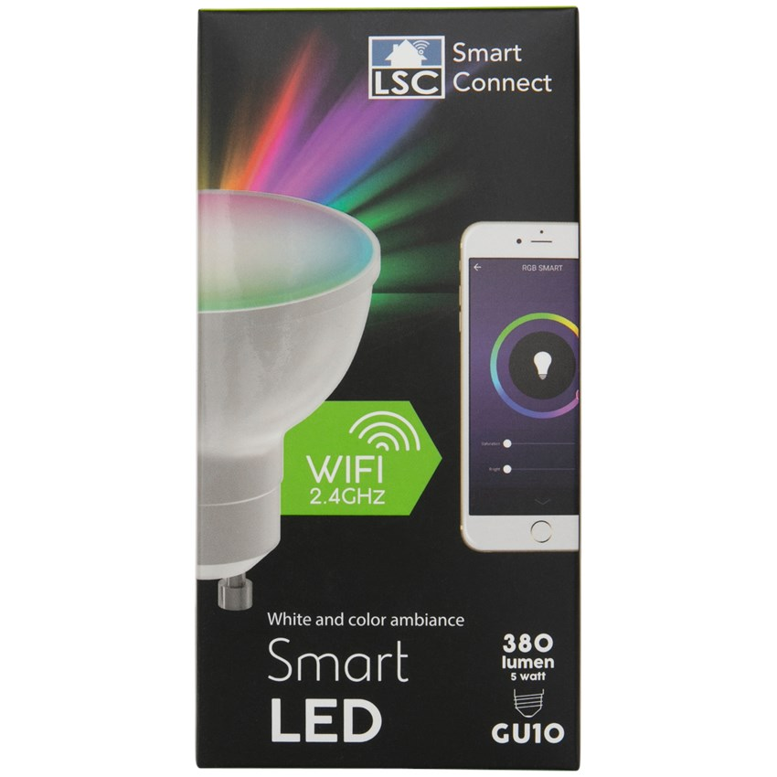 | 
[LSC Smart Connect LED GU10 5W RGB-CCT 380Lm 1800-2700K](https://www.action.com/fr-fr/p/spot-multicolore-connecte-lsc-smart-connect-2/) add description
|
|  | 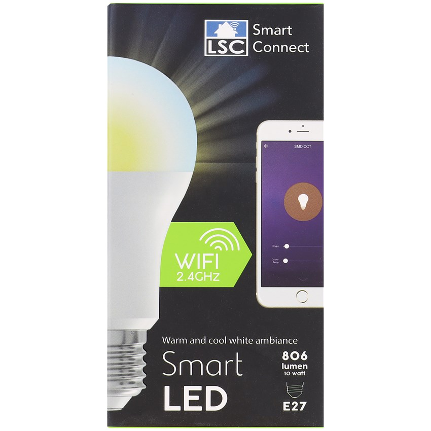 | 
[LSC Smart Connect LED E27 10W White 806Lm ](https://www.action.com/fr-fr/p/lampe-led-intelligente-lsc-smart-connect3/) add description
|
| 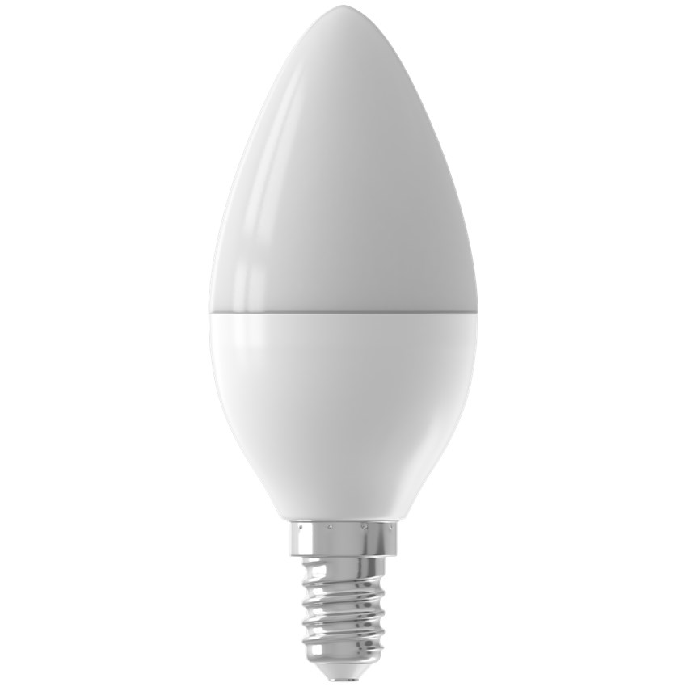 | 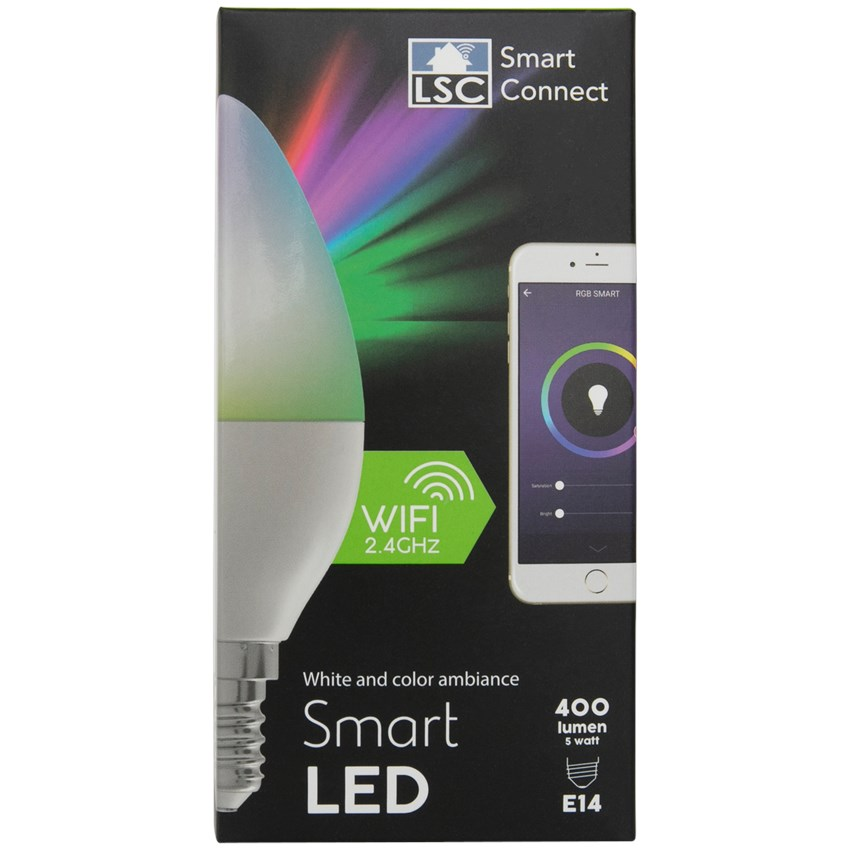 | 
[LSC Smart Connect LED E14 5W RGB-CCT 400Lm ](https://www.action.com/fr-fr/p/lampe-led-intelligente-lsc-smart-connect3/) add description
|

## Smart plugs
| Look | Packaging | Description |
|-|-|-|
| 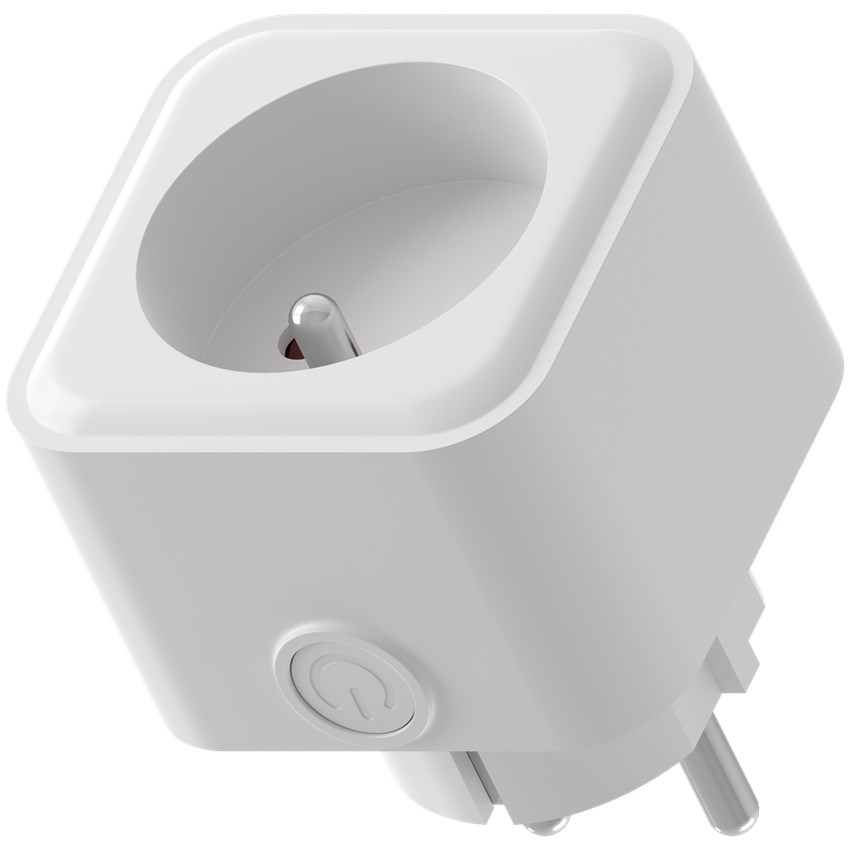 | 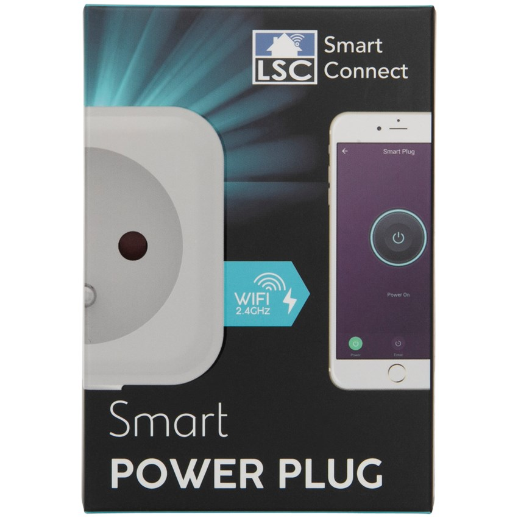 | 
[LSC Smart Connect Smart Plug](https://www.action.com/fr-fr/p/prise-intelligente-lsc-smart-connect/) This is the first smart plug that I bought (I actually bought 3 of them) and although it is very simple and easy to use, it does an amazing job at making any appliance smart. I plugged one to my washing machine and another one to my dishwasher: now I can program them to start just before I come back home, hence avoiding having wet clothes sitting all day in my washing machine ! As other LSC products, it is not directly compatible with Homekit, but the Homebridge plug-in works perfectly. It has a button to quickly switch it on and off without bothering Siri.

## Sensors
| Look | Packaging | Description |
|-|-|-|
| 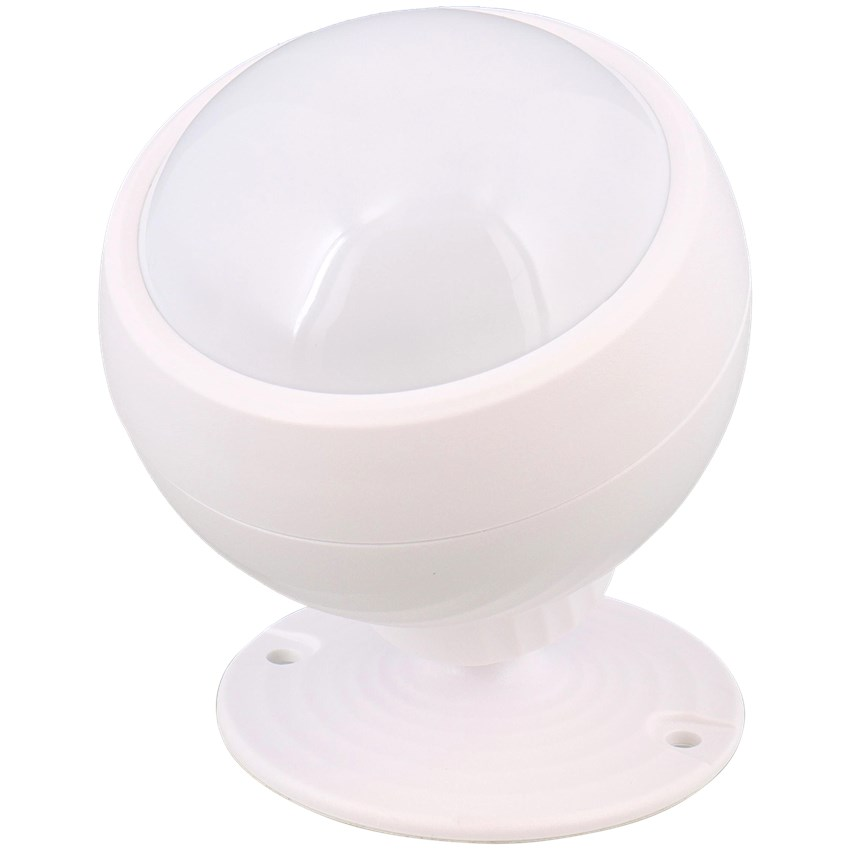 | 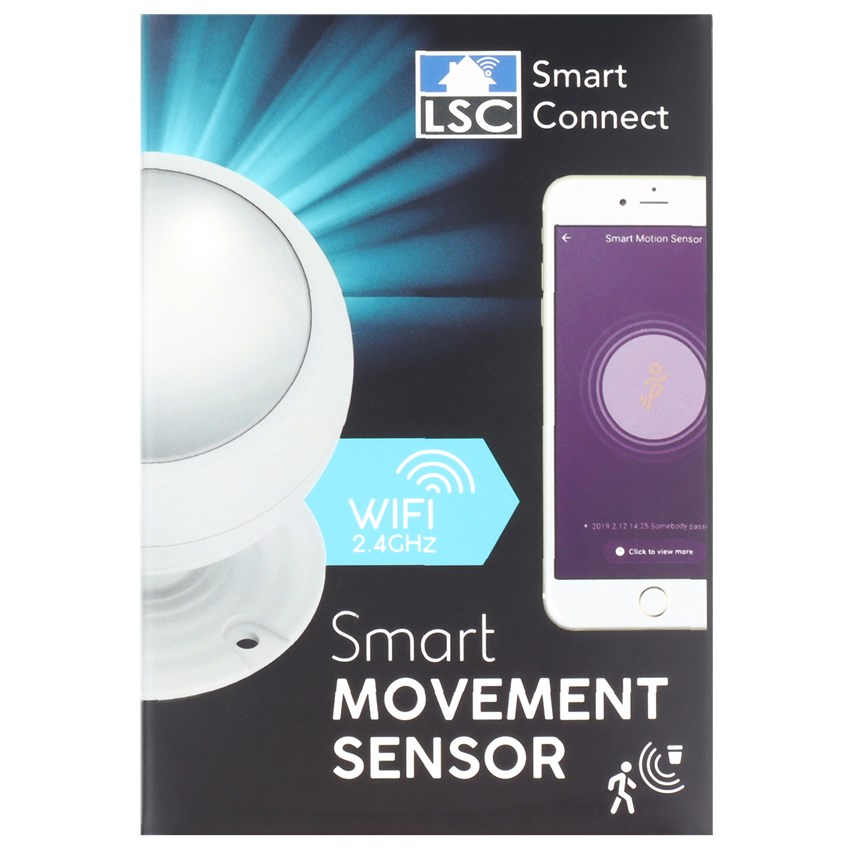 | 
[LSC Smart Connect Smart Movement Sensor](https://www.action.com/fr-fr/p/dummy-3000370/) My least favorite purchase so far. I wanted to couple it with my garage light but it doesn't work as well as I want it to. First, it is not compatible with HomeKit even using the Tuya Homebridge plug-in because the sensors is only connected when it detects movement. Secondly, it stops detecting motion for a while after it detects one (maybe 30 seconds) which sometime leads to weird situations. Last, it is very slow, and I sometime have to wait 15 seconds for my light to turn on !!!

# Switches
| Look | Packaging | Description |
|-|-|-|
| 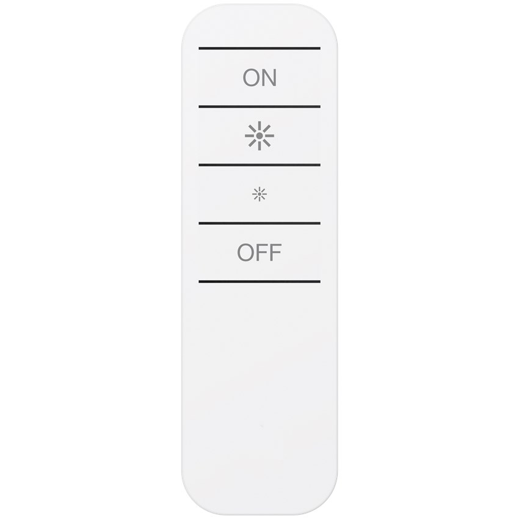 | 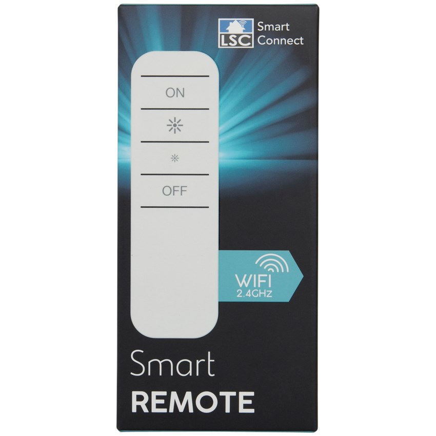 | 
[LSC Smart Connect Smart Remote](https://www.action.com/fr-fr/p/telecommande-lsc-smart-connect/) This is more a remote controller than a switch because it doesn't come with wall support. It communicate directly with the light without using a hub or Homekit so it is very fast, but that makes it only compatible with LSC products.

# BRANDS

Below I only list the brands of which I own at least a product.

## [Yeelight](https://www.yeelight.com/)

Yeelight is Xiaomi's smart lightning brand, they make very good quality products for reasonable prices. They focus on lightning products such as bulbs or LED strips.

## [LSC Smart Connect](https://www.action.com/fr-fr/brands/lsc-smart-connect/)

LSC Smart Connect products are sold at Action which is a discount-store chain located in a few European countries. They make medium to low quality products but very cheap too, so they are a good option to start a smart home on a budget.
LSC Smart Connect's products use Tuya services and are not compatible with Homekit. Hopefully, there are many Homebridge plug-ins which can do this job : I use "Tuya Lan2". I followed the instructions of [this blog post](http://www.experience2geek.com/tuto-lsc-smart-connect-avec-homekit/), which is written in French but comes with a very visual video. To bridge these lights to Homekit, we must create accounts on the [TuyaSmart app](https://apps.apple.com/fr/app/tuyasmart/id1034649547) and on the [Tuya Smart Developer Center](https://iot.tuya.com/).

# TIPS

## Disable "turned off" status on non-smart switches
Although my switches are not smart yet, I keep trying to turn my lights on using them, and end up disconnecting the lights. Most lights turn on when they are connected after being disconnected, and I found a tips in [Sébastien Goffin's video](https://www.youtube.com/watch?v=-o8XnqRYhOs) which takes advantage of this behavior. He suggests cutting a small rectangle from an expired credit card and fold it to mave a "V". This shape acts as a spring when put under the switch so when you push your switch, it turns off the light and immediately turns it back on.

## Use dummy switches
I use a HomeBridge plugin called "" to make dummy switches. They can be used in many way but I mainly use them to get the status of a non-smart thing. For exemple, I have one corresponding to our mailbox. It is quite far from our house so we often pick up the mail when we drive back home. The problem was several people would stop to pick the mail, even if the first one already picked it. The solution was creating a dummy switch which is on while the mail has been picked up and off while it has not, using two shortcuts: "Hey Siri, has someone picked the mail today ?" and "Hey Siri, I picked up the mail" and one automation to reset it to off everyday at midnight.

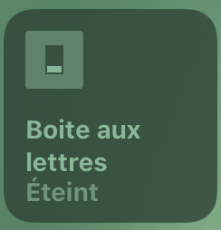

