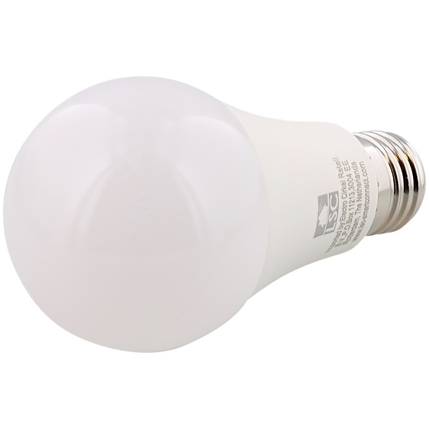

<h1 align="center">SMART HOME PROJECT</h1>

I recently decided to turn my "dumb" home into a smart one. I am doing it step by step and by testing lots of different brands or products to find the ones that best fit my needs.
I ran into multiple issues during the process so I decided to create this documentation to remind myself how I got over them, as well as help others who might encounter the same issues.

# CHOOSING AN ECOSYSTEM

## Which one did I choose ?

There are 3 main ecosystems when it comes to smart home: Apple's HomeKit, Google Home and Amazon's Alexa. They each have their pros and cons, and people with different tastes or means will have different preferences. I chose Apple's solution for many reasons:
  - Everyone in my house has at least an iPhone, we also have MacBooks, iPads and I have an Apple Watch, so we are all comfortable with Apple's ecosystem.
  - I find the Home app minimalist UI very pleasing and easy to use.
  - I am into iOS programming so if I ever start a smart home project, it is likely to be embedded in Apple's ecosystem.
  - We have a Google Nest and most HomeKit compatible products also work with Google Home, whereas the opposite isn't necessarily true.
  - I tend to trust Apple over Google or Amazon when it comes to privacy.

## HOOBS - How did I solve compatibility issues ?

One of HomeKit's biggest con is that the range of compatible products is not as wide as other ecosystems', and they are often very expensive (my YeeLight bulb cost the price of my 4 LSC Smart Connect bulbs).
Luckily, there are ways to fix compatibility issues, allowing us to turn (almost) any smart device into an HomeKit compatible device: I chose HOOBS, which stands for Homebridge out Of the Box System.

# MY SMART DEVICES

## Light Bulbs
| Look | Packaging | Description |
|-|-|-|
|  |  | 
[Yeelight Smart LED Bulb 1S](https://www.amazon.fr/Yeelight-millions-couleurs-Compatible-Assistant/dp/B0832XR68B/ref=sxts_sxwds-bia-wc-p13n1_0) I only own one bulb, which costs under 30€. It is HomeKit compatible and does not require a hub. It has a very wide range of colors and intensities. It is a bit big (20+ centimeters) but has a fine design. This is definitely my favorite bulb so far.
|
|  |  | 
[LSC Smart Connect LED GU10 5W RGB-CCT 380Lm 1800-2700K](https://www.action.com/fr-fr/p/spot-multicolore-connecte-lsc-smart-connect-2/) add description
|
|  |  | 
[LSC Smart Connect LED E27 10W White 806Lm ](https://www.action.com/fr-fr/p/lampe-led-intelligente-lsc-smart-connect3/) add description
|
|  |  | 
[LSC Smart Connect LED E14 5W RGB-CCT 400Lm ](https://www.action.com/fr-fr/p/lampe-led-intelligente-lsc-smart-connect3/) add description
|

## Smart plugs
| Look | Packaging | Description |
|-|-|-|
|  |  | 
[LSC Smart Connect Smart Plug](https://www.action.com/fr-fr/p/prise-intelligente-lsc-smart-connect/) add description

## Sensors
| Look | Packaging | Description |
|-|-|-|
|  |  | 
[LSC Smart Connect Smart Movement Sensor](https://www.action.com/fr-fr/p/dummy-3000370/) add description

